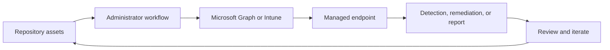

<!-- unified-readme:start -->
<div align="center">

# Custom Compliance Scripts

**PowerShell scripts for Microsoft Intune Custom Compliance policies and device configuration checks.**

Assess. Validate. Comply.

[](https://github.com/JayRHa/CustomComplianceScripts/stargazers)
[](https://github.com/JayRHa/CustomComplianceScripts/network/members)
[](https://github.com/JayRHa/CustomComplianceScripts/issues)
[](https://github.com/JayRHa/CustomComplianceScripts/graphs/contributors)

---

`Endpoint Management` | `PowerShell` | `Public` | `Maintained`

</div>

## What is this?

Custom Compliance Scripts supports Microsoft Intune and endpoint management workflows such as automation, troubleshooting, remediation, deployment, or reporting.

## Project Context

- Use it when Intune work should be scripted, packaged, synchronized, or made easier to repeat.
- Most workflows start from repository assets, then move through Microsoft Graph, Intune, or device-side execution.
- This repository is maintained as a practical project and reference asset.

## How It Works

The repository stores scripts or tooling, administrators configure or run them, Intune and Microsoft Graph apply the work, and endpoint results feed back into reports or follow-up actions.



## Quick Start

1. Review the project context and workflow below.
2. Clone the repository:

   ```bash
   git clone https://github.com/JayRHa/CustomComplianceScripts.git
   ```

3. Continue with the project-specific documentation in the next section.

---
<!-- unified-readme:end -->

<!-- project-documentation:start -->
## Project Documentation

The sections below contain the repository-specific setup, usage, and reference material for this project.

# CustomComplianceScripts
